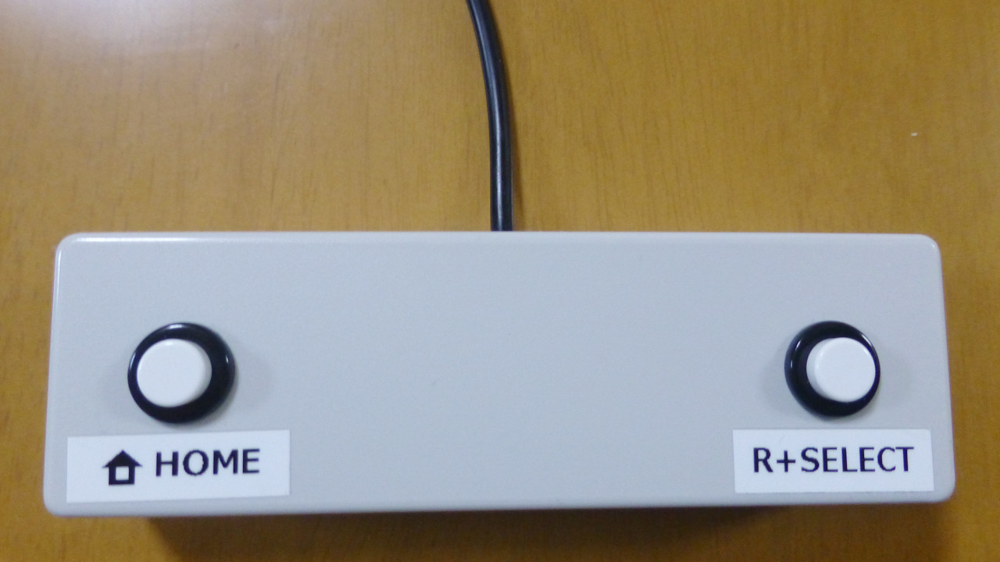

[English README is here](README.md)

# Classic Controller Pico

Classic Controller Pico は、Raspberry Pi PicoをWiiのクラシックコントローラとして認識させるプログラムです。

このプロジェクトは、Bruno Freitas氏の [Wii RetroPad Adapter](https://github.com/bootsector/wii-retropad-adapter) プロジェクトを元にしています。 
このプロジェクトのライセンスは、Wii RetroPadアダプターのライセンスに準じます。

## 動作確認済のハードウェア

* WiiU (Wiiリモコン経由)
* ニンテンドークラシックミニ スーパーファミコン
* ELECOM JC-W01UWH
* コロンバスサークル CC-NSSCV-RD
* [Controller Converter for Switch](https://github.com/tt3333/ControllerConverterForSwitch)

## ハードウェアの作り方

### 基板の発注

#### JLCPCBで、オーダー番号を目立たない場所に印字したい場合

gerber_JLCPCB.zip をアップロードし、「Remove Order Number」から「Specify a location」を選択してください。

#### JLCPCBで、オーダー番号を印字したくない場合

gerber.zip をアップロードし、「Remove Order Number」から「Yes」を選択してください。 
但し、Yesを選択するとオプション料金がかかります。

#### JLCPCB以外の場合

gerber.zip をアップロードしてください。

### 組み立て

* R1, R2に2kΩの抵抗を半田付けしてください。 
  (Raspberry Pi Picoの内蔵プルアップ抵抗は抵抗値が大き過ぎるため、外付けのプルアップ抵抗が無いと通信が安定しません。)
* D1にショットキーバリアダイオード (1N5819) を半田付けしてください。
* U1にソケットを半田付けし、Raspberry Pi Picoを取り付けてください。
* Wii用の延長ケーブルを半分に切り、オス側のケーブルをCN1に接続してください。
* CN2の各端子にお好みのボタンを接続してください。
* 現時点では、CN3は何も接続する必要はありません。 
  (将来のバージョンアップでアナログスティックの接続に対応するかもしれません。)
* CN4はファームウェアのデバッグ用なので、通常は何も接続する必要はありません。
* Raspberry Pi PicoのBOOTSELボタンを押しながらUSBケーブルを接続し、firmware.ino.sf2を書き込んでください。

### 使用例

タカチ電機工業のSW-130に、マル信無線電機のMS-350Mを2個取り付けた例です。 
コネクタを挿し替えるだけで簡単にボタンの割り当てを変更できるように、ピンヘッダを使用しました。 
ピンヘッダにコネクタを挿した状態だとケースの高さがギリギリのため、以下の点に注意してください。

* JLCPCBに基板を発注する際、「PCB Thickness」は標準の1.6mmではなく0.8mmを選択しました。 
  (追加料金がかからない範囲でできるだけ薄くしました。)
* スペーサーの代わりにナットを使用し、ナットとナットで基板を挟むようにして固定することで、基板とケースの間の隙間をナット1個分に抑えました。
* 基板裏面の出っ張りを抑えるため、抵抗やダイオードだけでなく、ICソケットやピンヘッダの足も短くカットしました。
* 足で操作する際に滑りにくくするため、裏面にセリアのクッションゴムを貼りました。

## ファームウェアを改造する場合

CN4にUSBシリアルコンバーターを接続し、config.h の `#define DEBUG` を有効にすると、デバッグ出力が利用できます。

### ファームウェアのビルド手順

1. Arduino IDEをインストール
2. firmware.inoを開く
3. 「File」→「Preferences...」をクリック
4. 「Additional boards manager URLs」欄に以下のURLをコピペし、「OK」をクリック 
   `https://github.com/earlephilhower/arduino-pico/releases/download/global/package_rp2040_index.json`
5. 「Tools」→「Board」→「Board Manager...」をクリック
6. 検索欄に「pico」と入力し、「Raspberry Pi Pico/RP2040 by Earle F. Philhower, III」をインストール
7. 「Tools」→「Board」→「Raspberry Pi Pico/RP2040」→「Raspberry Pi Pico」をクリック
8. 「Tools」→「Optimize」→「Fast (-Ofast) (maybe slower)」をクリック
9. 「Sketch」→「Export Compiled Binary」をクリック
