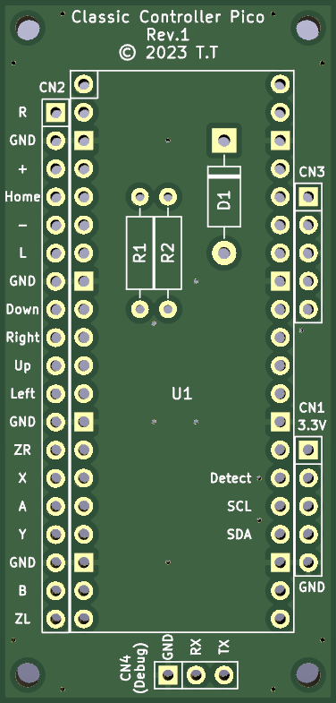
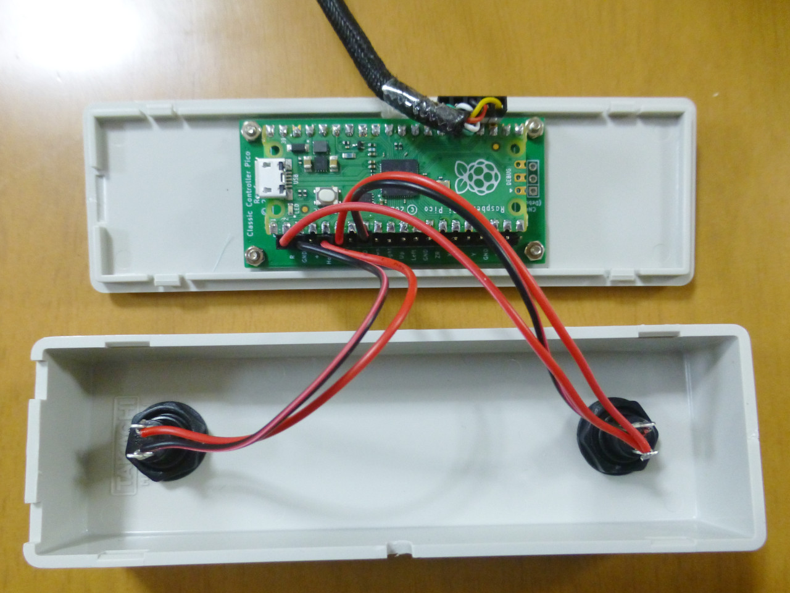

[日本語版 README はこちら](README-ja.md)

# Classic Controller Pico

Classic Controller Pico is a program that allows Raspberry Pi Pico to be recognized as Wii classic controller.

This project is based off of the [Wii RetroPad Adapter](https://github.com/bootsector/wii-retropad-adapter) project by Bruno Freitas. 
The license for this project follows the license for the Wii RetroPad adapter.

## Tested Hardware

* WiiU (via Wii Remote)
* SNES Classic Edition
* ELECOM JC-W01UWH
* Columbus Circle CC-NSSCV-RD
* [Controller Converter for Switch](https://github.com/tt3333/ControllerConverterForSwitch)

## How to Build Hardware

### Ordering PCBs

#### If you place an order with JLCPCB and want the order number printed in an inconspicuous location

Upload gerber_JLCPCB.zip and select "Specify a location" from the "Remove Order Number" options.

#### If you place an order with JLCPCB and do not want the order number printed

Upload gerber.zip and select "Yes" from the "Remove Order Number" options. 
However, if Yes is selected, an optional fee will be charged.

#### For orders outside of JLCPCB

Upload gerber.zip.

### Assembly

* Solder 2kΩ resistors to R1 and R2. 
  (Built-in pull-up resistors in Raspberry Pi Pico are too high in resistance, so communication is not stable without external pull-up resistors.)
* Solder a Schottky barrier diode (1N5819) to D1.
* Solder sockets to U1 and mount a Raspberry Pi Pico.
* Cut the extension cable for Wii in half and connect the Male cable to CN1.
* Connect buttons of your choice to each terminals of CN2.
* At this time, CN3 does not need to be connected to anything. 
  (A future version may support analog stick connection.)
* CN4 is for debugging firmware, so normally nothing needs to be connected.
* While pressing the BOOTSEL button on the Raspberry Pi Pico, connect the USB cable and write the firmware.ino.sf2.

### Example of Use

This is an example of two MS-350Ms from Marushin electric mfg. installed on a SW-130 from TAKACHI ELECTRONICS ENCLOSURE. 
Pin headers are used so that button assignments can be easily changed by simply replacing the connectors. 
Note the following points because the case is just barely high enough when the connectors is inserted into the pin headers.

* When ordering PCBs from JLCPCB, I chose 0.8mm for "PCB Thickness" instead of the standard 1.6mm.
  (I made it as thin as possible without incurring any additional charges.)
* By using a nuts instead of spacers and securing the board between the nut and nut, the gap between the board and case is reduced to one nut.
* To reduce the protrusion of the backside of the board, not only resistors and diodes but also the pins of IC sockets and pin headers are cut short.
* Rubber cushions are attached to the back surface to prevent slipping when operating with the feet.

## If you modify firmware

If you connect a USB serial converter to CN4 and enable `#define DEBUG` in config.h, debug output is available.

### How to Build Firmware

1. Install Arduino IDE
2. Open firmware.ino
3. Click "File", then "Preferences..."
4. Copy and paste the following URL into the "Additional boards manager URLs" field and click "OK" 
   `https://github.com/earlephilhower/arduino-pico/releases/download/global/package_rp2040_index.json`
5. Click "Tools", "Board", then "Board Manager..."
6. Type "pico" in the search field and install "Raspberry Pi Pico/RP2040 by Earle F. Philhower, III"
7. Click "Tools", "Board", "Raspberry Pi Pico/RP2040", then "Raspberry Pi Pico"
8. Click "Tools", "Optimize", then "Fast (-Ofast) (maybe slower)"
9. Click "Sketch", then "Export Compiled Binary"
